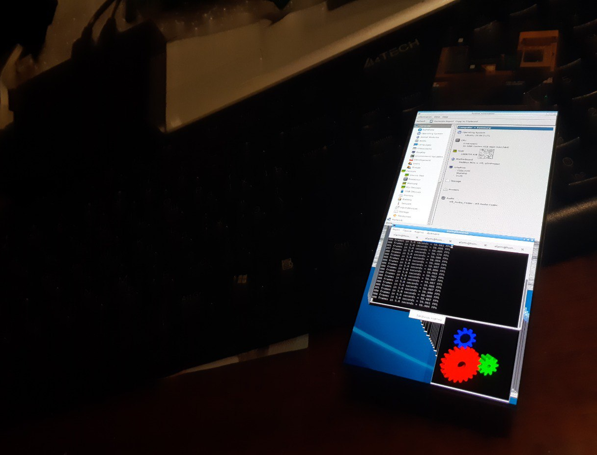
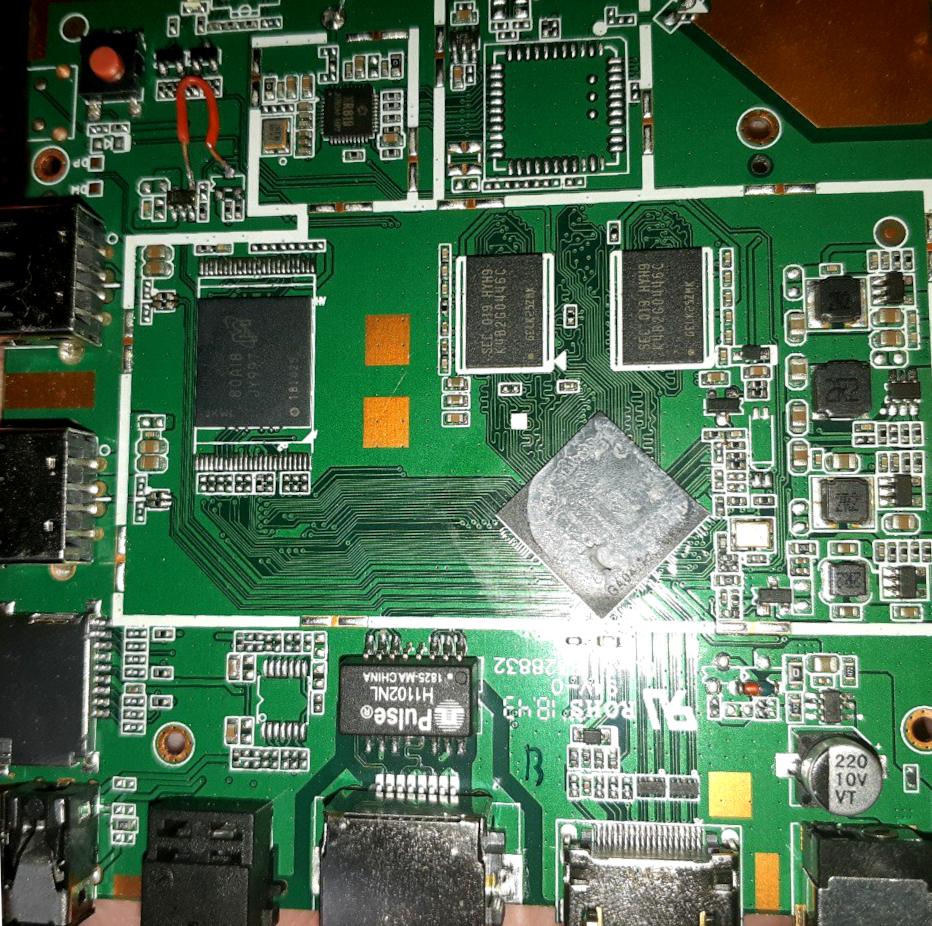
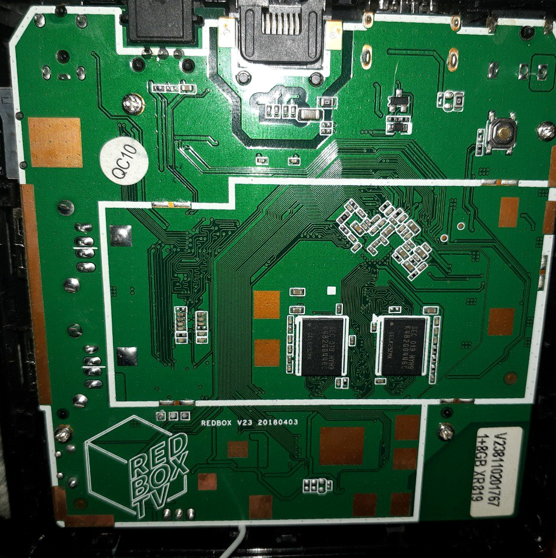
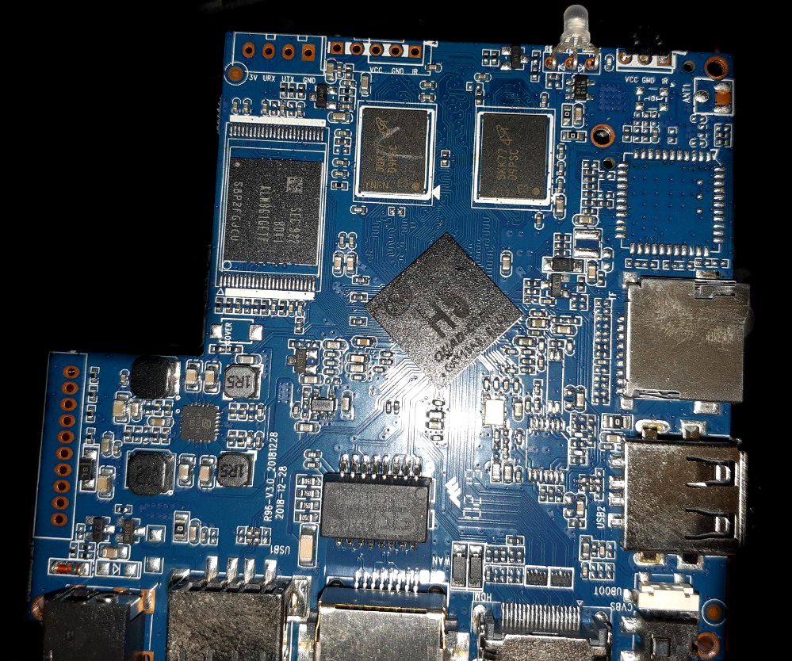
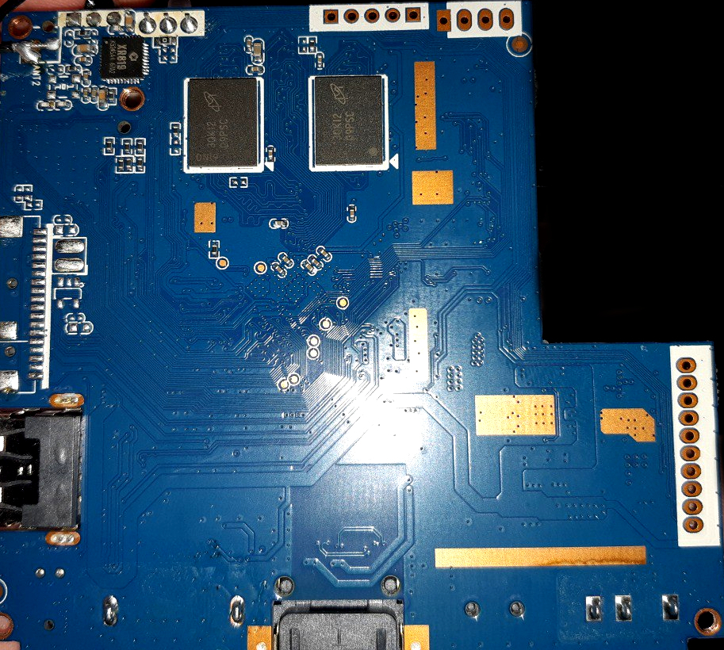
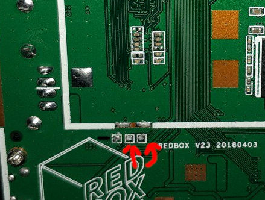

</img>

  
<b>[redboxmini5-armbian]</b>

(All technical information about the REDBOX MINI 5 device, including the ability to build the Linux ARMBIAN distribution.)

<b><i>Important: The data in this repository is experimental and may contain errors. This repository was developed primarily for devices with V1 and V2 specifications. Devices with less RAM and permanent memory, or different processors, are not currently supported.</b></i>

<b><i>Important: Users are solely responsible for making decisions about using this data and for collecting images to run third-party software.</b></i>

### Board versions

#### * V1

<b></img></img></b>

<b>CPU:</b> Allwinner H5 (AArch64, x4, 0.2Ghz-0.912Ghz <b>(1.01 GHz works too)</b>)

<b>MEM:</b> 1GB (DDR3, 336.00 GHz - 672.00 GHz <b>(1344.01 GHz works too)</b>)

<b>Eth:</b> Internal (100mbit)

<b>WI-FI:</b> XR819 (was not considered)

<b>USB:</b> x2 2.0, (works, presumably the board has contacts for additional USB.)

<b>EMMC:</b> Q2J55L (7.09 GiB) (works but not guaranteed)

<b>GPIO:</b> LED_PWR (1c20800, 15-PA15), LED_STATUS (1f02c00, 362-PL10), IR (1f02c00, 363-PL11), KEY_RESET (1f02c00, 355-PL3) (On this board you can get absolutely any gpio that is available on allwinner h5 (I’m just giving a list of those pins that you can get without much effort).)

#### * V2

<b></img></img></b>

<b>CPU:</b> Allwinner H5 (AArch64, x4, 0.2Ghz-0.912Ghz <b>(1.01 GHz works too)</b>)

<b>MEM:</b> 1GB (DDR3, 336.00 GHz - 672.00 GHz <b>(1344.01 GHz works too)</b>)

<b>Eth:</b> Internal (100mbit)

<b>WI-FI:</b> XR819 (was not considered)

<b>USB:</b> x2 2.0 (works)

<b>EMMC:</b> (works but not guaranteed)

<b>GPIO:</b> LED1 (1c20800, 15-PA15), LED2 (1f02c00, 362-PL10), KEY_POWER (1f02c00.pinctrl:356, PL4)  (On this board you can get absolutely any gpio that is available on allwinner h5 (I’m just giving a list of those pins that you can get without much effort).) (many other pins are probably similar to V1.).

### GPIO TABLE
<i>This table is not complete and was written more for version V1.</i>

|CHIP|NUM|NAME|FUNCTION|
|----|---|----|--------|
|1c20800.pinctrl|0|PA0||
|1c20800.pinctrl|1|PA1||
|1c20800.pinctrl|2|PA2||
|1c20800.pinctrl|3|PA3||
|1c20800.pinctrl|4|PA4|1c28000.uart, uart0 group PA4, <b>UART</b>|
|1c20800.pinctrl|5|PA5|1c28000.uart, uart0 group PA5, <b>UART</b>|
|1c20800.pinctrl|6|PA6||
|1c20800.pinctrl|7|PA7||
|1c20800.pinctrl|8|PA8||
|1c20800.pinctrl|9|PA9||
|1c20800.pinctrl|10|PA10||
|1c20800.pinctrl|11|PA11|1c20800.pinctrl:11, <b>TODO</b> WIFI wlan_hostwake? |
|1c20800.pinctrl|12|PA12||
|1c20800.pinctrl|13|PA13||
|1c20800.pinctrl|14|PA14||
|1c20800.pinctrl|15|PA15|1c20800.pinctrl:15, <b>LED</b> pwr_led |
|1c20800.pinctrl|16|PA16|1c20800.pinctrl:16|
|1c20800.pinctrl|17|PA17|1c21000.spdif-controller, spdif0 group PA17 |
|1c20800.pinctrl|18|PA18|1c2b000.twi, twi1 group PA18|
|1c20800.pinctrl|19|PA19|1c2b000.twi, twi1 group PA19|
|1c20800.pinctrl|20|PA20||
|1c20800.pinctrl|21|PA21||
|1c20800.pinctrl|64|PC0||
|1c20800.pinctrl|65|PC1|1c11000.sdmmc,  spi0 group PC1 <b>EMMC</b>|
|1c20800.pinctrl|66|PC2||
|1c20800.pinctrl|67|PC3||
|1c20800.pinctrl|68|PC4||
|1c20800.pinctrl|69|PC5|1c11000.sdmmc,  sdc2 group PC5 <b>EMMC</b>|
|1c20800.pinctrl|70|PC6|1c11000.sdmmc,  sdc2 group PC6 <b>EMMC</b>|
|1c20800.pinctrl|71|PC7||
|1c20800.pinctrl|72|PC8|1c11000.sdmmc,  sdc2 group PC8 <b>EMMC</b>|
|1c20800.pinctrl|73|PC9|1c11000.sdmmc,  sdc2 group PC9 <b>EMMC</b>|
|1c20800.pinctrl|74|PC10|1c11000.sdmmc,  sdc2 group PC10 <b>EMMC</b>|
|1c20800.pinctrl|75|PC11|1c11000.sdmmc,  sdc2 group PC11 <b>EMMC</b>|
|1c20800.pinctrl|76|PC12|1c11000.sdmmc,  sdc2 group PC12 <b>EMMC</b>|
|1c20800.pinctrl|77|PC13|1c11000.sdmmc,  sdc2 group PC13 <b>EMMC</b>|
|1c20800.pinctrl|78|PC14|1c11000.sdmmc,  sdc2 group PC14 <b>EMMC</b>|
|1c20800.pinctrl|79|PC15|1c11000.sdmmc,  sdc2 group PC15 <b>EMMC</b>|
|1c20800.pinctrl|80|PC16|1c11000.sdmmc,  sdc2 group PC16 <b>EMMC</b>|
|1c20800.pinctrl|81|PC17||
|1c20800.pinctrl|82|PC18||
|1c20800.pinctrl|96|PD0||
|1c20800.pinctrl|97|PD1||
|1c20800.pinctrl|98|PD2||
|1c20800.pinctrl|99|PD3||
|1c20800.pinctrl|100|PD4||
|1c20800.pinctrl|101|PD5||
|1c20800.pinctrl|102|PD6||
|1c20800.pinctrl|103|PD7||
|1c20800.pinctrl|104|PD8||
|1c20800.pinctrl|105|PD9||
|1c20800.pinctrl|106|PD10||
|1c20800.pinctrl|107|PD11||
|1c20800.pinctrl|108|PD12||
|1c20800.pinctrl|109|PD13||
|1c20800.pinctrl|110|PD14||
|1c20800.pinctrl|111|PD15||
|1c20800.pinctrl|112|PD16||
|1c20800.pinctrl|113|PD17||
|1c20800.pinctrl|128|PE0||
|1c20800.pinctrl|129|PE1||
|1c20800.pinctrl|130|PE2||
|1c20800.pinctrl|131|PE3||
|1c20800.pinctrl|132|PE4||
|1c20800.pinctrl|133|PE5||
|1c20800.pinctrl|134|PE6||
|1c20800.pinctrl|135|PE7||
|1c20800.pinctrl|136|PE8||
|1c20800.pinctrl|137|PE9||
|1c20800.pinctrl|138|PE10||
|1c20800.pinctrl|139|PE11||
|1c20800.pinctrl|140|PE12||
|1c20800.pinctrl|141|PE13||
|1c20800.pinctrl|142|PE14||
|1c20800.pinctrl|143|PE15||
|1c20800.pinctrl|160|PF0|1c0f000.sdmmc, group PF0 <b>SDCARD</b>|
|1c20800.pinctrl|161|PF1|1c0f000.sdmmc, group PF1 <b>SDCARD</b>|
|1c20800.pinctrl|162|PF2|1c0f000.sdmmc, group PF2 <b>SDCARD</b>|
|1c20800.pinctrl|163|PF3|1c0f000.sdmmc, group PF3 <b>SDCARD</b>|
|1c20800.pinctrl|164|PF4|1c0f000.sdmmc, group PF4 <b>SDCARD</b>|
|1c20800.pinctrl|165|PF5|1c0f000.sdmmc, group PF5 <b>SDCARD</b>|
|1c20800.pinctrl|166|PF6|1c20800.pinctrl:166, sdcard0 cd-gpios <b>SDCARD</b>|
|1c20800.pinctrl|192|PG0|1c10000.sdmmc,  sdc1 group PG0 <b>WIFI</b>|
|1c20800.pinctrl|193|PG1|1c10000.sdmmc,  sdc1 group PG1 <b>WIFI</b>|
|1c20800.pinctrl|194|PG2|1c10000.sdmmc,  sdc1 group PG2 <b>WIFI</b>|
|1c20800.pinctrl|195|PG3|1c10000.sdmmc,  sdc1 group PG3 <b>WIFI</b>|
|1c20800.pinctrl|196|PG4|1c10000.sdmmc,  sdc1 group PG4 <b>WIFI</b>|
|1c20800.pinctrl|197|PG5|1c10000.sdmmc,  sdc1 group PG5 <b>WIFI</b>|
|1c20800.pinctrl|198|PG6|1c28400.uart,  uart1 group PG6|
|1c20800.pinctrl|199|PG7|1c28400.uart,  uart1 group PG7|
|1c20800.pinctrl|200|PG8|1c28400.uart,  uart1 group PG8|
|1c20800.pinctrl|201|PG9|1c28400.uart,  uart1 group PG9|
|1c20800.pinctrl|202|PG10|1c22400.daudio,  pcm1 group PG10|
|1c20800.pinctrl|203|PG11|1c22400.daudio,  pcm1 group PG11|
|1c20800.pinctrl|204|PG12|1c22400.daudio,  pcm1 group PG12|
|1c20800.pinctrl|205|PG13|1c22400.daudio,  pcm1 group PG13|
|_||||
|1f02c00.pinctrl|352|PL0|1f02400.s_twi 1f02c00.pinctrl:352, s_twi0 group PL0 <b>TODO</b> WIFI wlan_regon? |
|1f02c00.pinctrl|353|PL1|1f02400.s_twi 1f02c00.pinctrl:353, s_twi0 group PL1 <b>TODO</b> WIFI bt_rst? |
|1f02c00.pinctrl|354|PL2|1f02c00.pinctrl:354, USB DC/DC converter output (5V) |
|1f02c00.pinctrl|355|PL3|1f02c00.pinctrl:355, <b>V1, KEY</b> button reset |
|1f02c00.pinctrl|356|PL4|<b>TODO?! ONLY FOR V2</b>, 1f02c00.pinctrl:356, <b>V2, KEY</b> button power (not soldered) |
|1f02c00.pinctrl|357|PL5| <b>TODO</b> UNKNOWN, It is not recommended to use as it will most likely damage the chip. |
|1f02c00.pinctrl|358|PL6| <b>TODO</b> UNKNOWN |
|1f02c00.pinctrl|359|PL7|1f02c00.pinctrl:359, <b>TODO</b> WIFI DC/DC 1.8V? |
|1f02c00.pinctrl|360|PL8| <b>TODO</b> UNKNOWN, It is not recommended to use as it will most likely damage the chip. |
|1f02c00.pinctrl|361|PL9| <b>TODO?!</b> Most likely, this is the enabling pin of the DC/DC converter on the DRAM circuit (1.5V). |
|1f02c00.pinctrl|362|PL10|1f02c00.pinctrl:362, <b>V1, LED</b> status_led |
|1f02c00.pinctrl|363|PL11|1f02000.s_cir, s_cir0 IR |

### POWER TABLE

<i>This table is not complete and was written more for version V1.</i>

|VALUE|FUNCTION|
|-----|--------|
|3.3  |SYS     |
|1.1  |CPUA    |
|1.5  |DRAM    |
|5.0  |USB     |
|3.3  |WIFI    |

### UART (DEBUG)

#### * V1 (115200, 3.3)

</img>

#### * V2 (115200, 3.3)

<b>Just like on V1, the contacts are marked on the board.</b>

### Quick answers to questions

#### * Will there be support for 1.2/1.5 GHz processor frequencies?

These boxes do not have an adjustable VDD-CPUX regulator (usually this can be implemented with either a GPIO transistor or an i2c regulator) and use a constant voltage of 1.1V to operate. This does not improve power savings and does not increase the supply voltage to 1 ,3 V.V in situations where it is necessary. Without a voltage of 1.3V it is impossible to obtain these frequencies.

#### * Will there be WI-FI support?

Not at the moment due to the difficulty of obtaining working and up-to-date driver source code. Also, this chip is not very productive and preference remains for wired eth or usb wifi.

#### * I2C support?

Not a single port is working, all i2c buses in the device tree are disabled. I2C0, I2C1, I2C2 are physically blocked.

<i>TODO? In theory you can use pins PL0, PL1, supposedly used for the WIFI chip.</i>

### License

All rights reserved.
